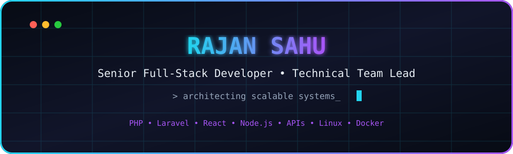
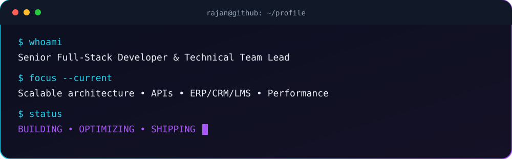
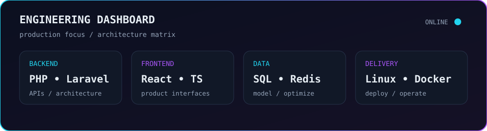

<div align="center">



<br/>

[](https://rajan.freedev.app)
[](https://www.linkedin.com/in/rajan-sahu-a2a74a2a8)
[](https://github.com/rajan-sahu)


</div>

<br/>



## ⚡ Professional Snapshot

<table>
<tr>
<td width="50%" valign="top">

### 👨‍💻 Engineering
- Full-stack product development
- Backend & system architecture
- REST APIs & third-party integrations
- Database design & optimization
- Performance-focused engineering

</td>
<td width="50%" valign="top">

### 🏗️ Leadership & Products
- Technical team leadership
- Enterprise ERP / CRM / LMS platforms
- SaaS & workflow systems
- Payment and webhook integrations
- Production deployment & operations

</td>
</tr>
</table>

## 🛠️ Technology Matrix

<div align="center">

**Frontend**


**Backend**


**Data**


**DevOps & Tools**


</div>

## 🧬 Architecture DNA

```javascript
const rajan = {
  role: "Senior Full-Stack Developer & Technical Team Lead",

  stack: {
    frontend: ["React", "TypeScript", "Next.js", "JavaScript"],
    backend: ["PHP", "Laravel", "Node.js", "Express", "Python"],
    data: ["MySQL", "PostgreSQL", "MongoDB", "Redis"],
    infrastructure: ["Linux", "Docker", "Cloudflare", "CI/CD"]
  },

  builds: ["ERP", "CRM", "LMS", "SaaS", "REST APIs", "Workflow Systems"],

  priorities: [
    "Clean architecture",
    "Reliable systems",
    "Measurable performance",
    "Maintainable code"
  ],

  loop: "Think → Design → Build → Test → Optimize → Ship"
};
```

## 🧠 Core Expertise

<div align="center">


</div>

## 🚀 What I Build

<table>
<tr>
<td width="50%" valign="top">

### 🏢 Enterprise Platforms
ERP, CRM and administration systems with role-based permissions, operational workflows and reporting.

`RBAC` `Workflows` `Reports` `Automation`

</td>
<td width="50%" valign="top">

### 🌐 Full-Stack Products
Production applications spanning interfaces, APIs, business logic, authentication, data and deployment.

`Laravel` `React` `Node.js` `MySQL`

</td>
</tr>
<tr>
<td width="50%" valign="top">

### 🔌 APIs & Integrations
REST APIs, payment gateways, webhooks and integrations connecting internal and external systems.

`REST` `Payments` `Webhooks` `Integrations`

</td>
<td width="50%" valign="top">

### ⚙️ Infrastructure
Linux environments, Docker workflows, Cloudflare, Git and application performance optimization.

`Linux` `Docker` `Cloudflare` `Git` `CI/CD`

</td>
</tr>
</table>

## 📊 Engineering Dashboard



> The dashboard is stored directly in this repository, so it does not depend on a third-party GitHub statistics API or its rate limits.

## 🔥 GitHub Streak

<div align="center">


</div>

## 🎯 Engineering Principles

| Principle | Approach |
|---|---|
| 🧱 Architecture | Design for maintainability before complexity arrives |
| ⚡ Performance | Measure bottlenecks, then optimize what matters |
| 🔐 Reliability | Validate inputs, permissions and failure paths |
| 🗄️ Data | Model cleanly, index intentionally, query efficiently |
| 🤝 Leadership | Make technical decisions understandable and actionable |
| 🚀 Delivery | Ship usable software, observe it, improve it |

## 🤝 Let's Connect

<div align="center">

**Building something technically challenging?**

[](https://rajan.freedev.app)
[](https://www.linkedin.com/in/rajan-sahu-a2a74a2a8)

<br/><br/>


</div>
